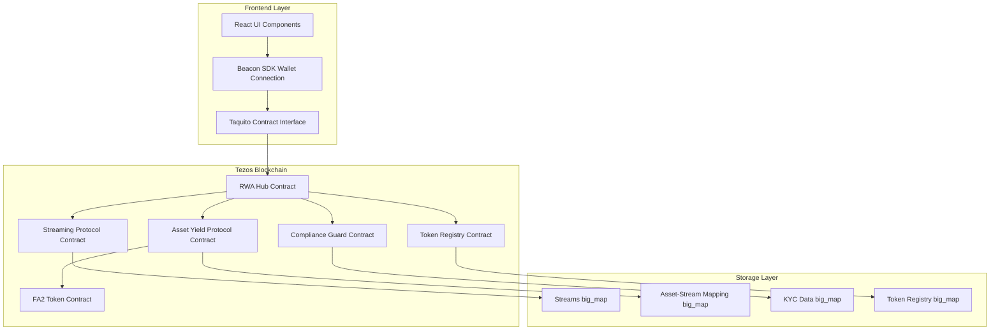

# Design Document: Continuum Protocol - Aptos to Tezos Migration

## Overview

This design document outlines the technical approach for migrating the Continuum Protocol from Aptos blockchain to Tezos blockchain. The migration involves three major components:

1. **Smart Contract Migration**: Converting five Move modules to Tezos smart contracts (SmartPy/LIGO)
2. **Frontend Migration**: Replacing Aptos SDK/wallet integration with Taquito/Beacon SDK
3. **Data Migration**: Transferring existing protocol state from Aptos to Tezos

### Key Design Decisions

**Smart Contract Language Choice**: We will use **SmartPy** for the initial implementation due to:
- Python-like syntax that's more accessible to developers
- Strong testing framework with simulation capabilities
- Good documentation and community support
- Ability to compile to Michelson (Tezos bytecode)
- LIGO can be considered for performance-critical modules if needed

**Token Standard**: We will use **FA2 (TZIP-12)** for both fungible yield tokens and non-fungible RWA tokens because:
- It's the standard multi-asset token interface on Tezos
- Supports both fungible and non-fungible tokens in one contract
- Has transfer hooks that enable automatic yield stream updates on NFT transfers
- Wide ecosystem support (wallets, explorers, marketplaces)

**Storage Pattern**: We will use **big_maps** for all key-value storage because:
- They provide O(1) access like Aptos Tables
- Storage costs are paid per entry, not for the entire map
- They're optimized for large datasets
- They support lazy deserialization for gas efficiency

### Migration Strategy

The migration will follow a phased approach:
1. **Phase 1**: Deploy and test contracts on Ghostnet (Tezos testnet)
2. **Phase 2**: Migrate frontend to work with Ghostnet contracts
3. **Phase 3**: Export data from Aptos and prepare migration scripts
4. **Phase 4**: Deploy to Tezos Mainnet and execute data migration
5. **Phase 5**: Sunset Aptos deployment and redirect users to Tezos


## Architecture

### High-Level Architecture



### Contract Architecture

The protocol consists of five main contracts that mirror the Aptos implementation:

1. **Streaming Protocol Contract**: Core time-based payment streaming logic
2. **Asset Yield Protocol Contract**: NFT-to-stream coupling and ownership tracking
3. **Compliance Guard Contract**: KYC/AML enforcement and access control
4. **Token Registry Contract**: Global RWA NFT discovery and marketplace support
5. **RWA Hub Contract**: Main orchestrator coordinating all components

### Data Flow

**Stream Creation Flow**:
```
User → RWA Hub → Compliance Check → Asset Yield Protocol → Streaming Protocol → Escrow Lock → Token Registry
```

**Yield Claim Flow**:
```
User → RWA Hub → Registry Lookup → Compliance Check → Asset Ownership Verification → Stream Withdrawal → Token Transfer
```

**NFT Transfer Flow**:
```
User → FA2 Transfer → Transfer Hook → Asset Yield Protocol → Update Stream Recipient
```


## Components and Interfaces

### 1. Streaming Protocol Contract

**Purpose**: Manages time-based token streaming with escrow, withdrawal, and flash advance functionality.

**Storage Structure** (SmartPy):
```python
sp.TRecord(
    streams = sp.TBigMap(
        sp.TNat,  # stream_id
        sp.TRecord(
            sender = sp.TAddress,
            recipient = sp.TAddress,
            token_address = sp.TAddress,  # FA2 contract
            token_id = sp.TNat,           # FA2 token_id
            total_amount = sp.TNat,
            flow_rate = sp.TNat,          # tokens per second
            start_time = sp.TTimestamp,
            stop_time = sp.TTimestamp,
            amount_withdrawn = sp.TNat,
            status = sp.TNat,             # 0=active, 1=paused, 2=cancelled
        )
    ),
    next_stream_id = sp.TNat,
    admin = sp.TAddress,
)
```

**Key Entrypoints**:

- `create_stream(recipient, token_address, token_id, flow_rate, duration, total_amount)`: Creates a new stream and locks tokens in escrow
  - Validates parameters (amount > 0, duration > 0, flow_rate > 0)
  - Transfers tokens from sender to contract using FA2 transfer
  - Initializes stream record with current timestamp
  - Returns stream_id for reference

- `withdraw(stream_id)`: Allows recipient to claim accumulated tokens
  - Calculates claimable balance: min((now - start_time) * flow_rate - amount_withdrawn, total_amount - amount_withdrawn)
  - Verifies caller is stream recipient
  - Updates amount_withdrawn
  - Transfers tokens from contract to recipient

- `flash_advance(stream_id, amount_requested)`: Immediate withdrawal of future yield
  - Verifies caller is stream recipient
  - Checks amount_requested <= (total_amount - amount_withdrawn)
  - Increments amount_withdrawn by amount_requested
  - Transfers tokens immediately
  - Stream continues but with higher amount_withdrawn (effectively pausing future claims)

- `cancel_stream(stream_id)`: Cancels stream and refunds remaining balance
  - Verifies caller is sender or recipient
  - Calculates remaining balance: total_amount - amount_withdrawn
  - Transfers remaining tokens back to sender
  - Marks stream as cancelled

**View Functions**:
- `get_claimable_balance(stream_id)`: Returns current claimable amount without gas cost
- `get_stream_info(stream_id)`: Returns complete stream details
- `get_escrow_balance(stream_id)`: Returns remaining tokens in escrow

### 2. Asset Yield Protocol Contract

**Purpose**: Links FA2 NFTs to yield streams and automatically updates stream recipients on NFT transfers.

**Storage Structure**:
```python
sp.TRecord(
    asset_to_stream = sp.TBigMap(sp.TAddress, sp.TNat),  # NFT address -> stream_id
    stream_to_asset = sp.TBigMap(sp.TNat, sp.TAddress),  # stream_id -> NFT address
    streaming_protocol_address = sp.TAddress,
    admin = sp.TAddress,
)
```

**Key Entrypoints**:

- `create_asset_yield_stream(token_address, total_yield, duration)`: Creates stream linked to NFT
  - Verifies caller owns the NFT (via FA2 balance_of)
  - Calls streaming protocol to create stream
  - Stores bidirectional mapping (asset ↔ stream)
  - Returns stream_id

- `claim_yield_for_asset(token_address)`: Claims yield for NFT owner
  - Looks up stream_id from asset_to_stream mapping
  - Verifies caller owns the NFT
  - Calls streaming protocol withdraw
  - Returns amount claimed

- `flash_advance_rwa_yield(token_address, amount_requested)`: Flash advance for NFT owner
  - Looks up stream_id from asset_to_stream mapping
  - Verifies caller owns the NFT
  - Calls streaming protocol flash_advance

- `update_stream_recipient(token_address, new_owner)`: Updates stream recipient on NFT transfer
  - Called by FA2 transfer hook
  - Looks up stream_id
  - Calls streaming protocol to update recipient
  - Ensures yield follows the asset

**View Functions**:
- `get_stream_for_asset(token_address)`: Returns stream_id for an NFT
- `get_asset_for_stream(stream_id)`: Returns NFT address for a stream
- `get_claimable_yield(token_address)`: Returns claimable balance for NFT


### 3. Compliance Guard Contract

**Purpose**: Enforces KYC/AML requirements and provides emergency freeze capabilities.

**Storage Structure**:
```python
sp.TRecord(
    identities = sp.TBigMap(
        sp.TAddress,
        sp.TRecord(
            is_verified = sp.TBool,
            jurisdiction = sp.TString,
            verification_level = sp.TNat,
            expiry_time = sp.TTimestamp,
            whitelisted_asset_types = sp.TSet(sp.TNat),  # Set of allowed asset types
        )
    ),
    frozen_streams = sp.TBigMap(sp.TNat, sp.TBool),  # stream_id -> is_frozen
    admins = sp.TSet(sp.TAddress),
    asset_types = sp.TMap(sp.TNat, sp.TString),  # 0=real_estate, 1=vehicles, 2=commodities
)
```

**Key Entrypoints**:

- `register_identity(user, jurisdiction, verification_level, expiry_time)`: Registers KYC data
  - Admin only
  - Stores identity information
  - Sets is_verified to true
  - Initializes empty whitelisted_asset_types set

- `whitelist_address(user, asset_types)`: Grants access to specific asset types
  - Admin only
  - Adds asset types to user's whitelisted_asset_types set
  - Requires valid KYC (is_verified = true, expiry_time > now)

- `freeze_stream(stream_id, reason)`: Emergency freeze of a stream
  - Admin only
  - Marks stream as frozen in frozen_streams map
  - Emits freeze event with reason

- `unfreeze_stream(stream_id)`: Removes freeze on a stream
  - Admin only
  - Removes stream from frozen_streams map

- `add_admin(new_admin)`: Adds a new admin
  - Admin only
  - Adds address to admins set

**View Functions**:
- `is_authorized_recipient(user, asset_type)`: Returns true if user has valid KYC and is whitelisted for asset type
- `is_stream_frozen(stream_id)`: Returns freeze status
- `has_valid_kyc(user)`: Returns true if KYC is verified and not expired
- `is_admin(user)`: Returns true if user is an admin

### 4. Token Registry Contract

**Purpose**: Global registry of all RWA NFTs for marketplace discovery and filtering.

**Storage Structure**:
```python
sp.TRecord(
    tokens = sp.TBigMap(
        sp.TAddress,  # token_address
        sp.TRecord(
            asset_type = sp.TNat,      # 0=real_estate, 1=vehicles, 2=commodities
            stream_id = sp.TNat,
            metadata_uri = sp.TString,
            registration_time = sp.TTimestamp,
        )
    ),
    stream_to_token = sp.TBigMap(sp.TNat, sp.TAddress),  # stream_id -> token_address
    tokens_by_type = sp.TBigMap(sp.TNat, sp.TSet(sp.TAddress)),  # asset_type -> set of tokens
    token_count = sp.TNat,
)
```

**Key Entrypoints**:

- `register_token(token_address, asset_type, stream_id, metadata_uri)`: Registers a new RWA NFT
  - Verifies token not already registered
  - Stores token information
  - Adds to tokens_by_type set
  - Creates stream_to_token mapping
  - Increments token_count

**View Functions**:
- `get_token(token_address)`: Returns token information
- `get_token_by_stream_id(stream_id)`: Returns token address for a stream
- `get_tokens_by_type(asset_type)`: Returns set of tokens for an asset type
- `get_all_tokens_paginated(offset, limit)`: Returns paginated list of all tokens
- `get_token_count()`: Returns total number of registered tokens
- `get_asset_type_by_token(token_address)`: Returns asset type for a token

### 5. RWA Hub Contract

**Purpose**: Main orchestrator that coordinates all protocol components and provides high-level user-facing functions.

**Storage Structure**:
```python
sp.TRecord(
    streaming_protocol = sp.TAddress,
    asset_yield_protocol = sp.TAddress,
    compliance_guard = sp.TAddress,
    token_registry = sp.TAddress,
    active_rentals = sp.TBigMap(sp.TAddress, sp.TNat),  # token_address -> rental_stream_id
    admin = sp.TAddress,
)
```

**Key Entrypoints**:

- `create_compliant_rwa_stream(token_address, total_yield, duration, asset_type, metadata_uri)`: One-stop RWA stream creation
  - Checks compliance authorization for asset_type
  - Calls asset_yield_protocol.create_asset_yield_stream
  - Calls token_registry.register_token
  - Returns stream_id

- `compliant_claim_yield(token_address)`: Claim yield with automatic compliance check
  - Looks up asset_type from token_registry
  - Checks compliance authorization
  - Calls asset_yield_protocol.claim_yield_for_asset

- `compliant_flash_advance(token_address, amount_requested)`: Flash advance with compliance check
  - Looks up asset_type from token_registry
  - Checks compliance authorization
  - Calls asset_yield_protocol.flash_advance_rwa_yield

- `stream_rent_to_asset(token_address, payment_amount, duration)`: Creates rental stream
  - Looks up current NFT owner
  - Creates stream from tenant (caller) to landlord (owner)
  - Stores stream_id in active_rentals mapping

- `emergency_freeze(stream_id, reason)`: Admin emergency freeze
  - Admin only
  - Calls compliance_guard.freeze_stream

- `batch_whitelist(users, asset_types)`: Batch whitelist multiple users
  - Admin only
  - Loops through users and calls compliance_guard.whitelist_address

**View Functions**:
- `can_participate(user, asset_type)`: Returns if user can participate in RWA ecosystem
- `get_stream_status(stream_id)`: Returns complete stream status including compliance
- `get_user_compliance_status(user)`: Returns user's compliance status
- `check_access_status(stream_id, token_address)`: Returns if rental stream grants access (for IoT)
- `get_active_rental(token_address)`: Returns active rental stream_id for an asset


### 6. FA2 Token Contract

**Purpose**: Standard FA2 implementation for RWA NFTs with transfer hooks for yield stream updates.

**Storage Structure**:
```python
sp.TRecord(
    ledger = sp.TBigMap(
        sp.TPair(sp.TAddress, sp.TNat),  # (owner, token_id)
        sp.TNat  # balance (1 for NFTs)
    ),
    token_metadata = sp.TBigMap(
        sp.TNat,  # token_id
        sp.TRecord(
            token_id = sp.TNat,
            token_info = sp.TMap(sp.TString, sp.TBytes),  # metadata key-value pairs
        )
    ),
    operators = sp.TBigMap(
        sp.TPair(sp.TAddress, sp.TAddress),  # (owner, operator)
        sp.TSet(sp.TNat)  # set of token_ids
    ),
    next_token_id = sp.TNat,
    asset_yield_protocol = sp.TAddress,  # for transfer hooks
    admin = sp.TAddress,
)
```

**Key Entrypoints**:

- `mint(to, metadata)`: Mints a new RWA NFT
  - Admin only
  - Assigns next_token_id
  - Sets balance to 1 in ledger
  - Stores metadata
  - Increments next_token_id

- `transfer(transfers)`: FA2 standard transfer
  - Validates sender owns tokens or is operator
  - Updates ledger balances
  - **Calls transfer hook**: Notifies asset_yield_protocol of ownership change
  - Transfer hook updates stream recipient automatically

- `update_operators(updates)`: FA2 standard operator management
  - Allows delegation of transfer rights
  - Updates operators mapping

- `balance_of(requests)`: FA2 standard balance query
  - Returns balances for requested (owner, token_id) pairs

**View Functions**:
- `get_balance(owner, token_id)`: Returns balance (0 or 1 for NFTs)
- `token_metadata(token_id)`: Returns metadata for a token


## Data Models

### Stream Data Model

Represents a time-based payment stream with escrow.

```python
Stream = sp.TRecord(
    sender = sp.TAddress,           # Who created and funded the stream
    recipient = sp.TAddress,        # Who receives the streamed tokens
    token_address = sp.TAddress,    # FA2 contract address
    token_id = sp.TNat,            # FA2 token_id (for fungible yield tokens)
    total_amount = sp.TNat,        # Total tokens locked in escrow
    flow_rate = sp.TNat,           # Tokens per second (in smallest unit)
    start_time = sp.TTimestamp,    # When streaming begins
    stop_time = sp.TTimestamp,     # When streaming ends
    amount_withdrawn = sp.TNat,    # Total withdrawn so far
    status = sp.TNat,              # 0=active, 1=paused, 2=cancelled, 3=depleted
)
```

**Calculation Logic**:
- `claimable_balance = min((current_time - start_time) * flow_rate, total_amount) - amount_withdrawn`
- `remaining_balance = total_amount - amount_withdrawn`
- `time_remaining = max(0, stop_time - current_time)`

**Invariants**:
- `amount_withdrawn <= total_amount` (always)
- `start_time < stop_time` (always)
- `flow_rate > 0` (always)
- `total_amount = flow_rate * (stop_time - start_time)` (at creation)

### Identity Data Model

Represents KYC/AML compliance information for a user.

```python
Identity = sp.TRecord(
    is_verified = sp.TBool,                      # KYC verification status
    jurisdiction = sp.TString,                   # Country/region code
    verification_level = sp.TNat,                # 0=basic, 1=enhanced, 2=institutional
    expiry_time = sp.TTimestamp,                # When KYC expires
    whitelisted_asset_types = sp.TSet(sp.TNat), # Asset types user can trade
)
```

**Authorization Logic**:
- User is authorized if: `is_verified AND current_time < expiry_time AND asset_type IN whitelisted_asset_types`

### Token Registry Entry

Represents a registered RWA NFT in the global marketplace.

```python
TokenEntry = sp.TRecord(
    asset_type = sp.TNat,           # 0=real_estate, 1=vehicles, 2=commodities
    stream_id = sp.TNat,           # Linked yield stream
    metadata_uri = sp.TString,     # IPFS or HTTP URL to metadata JSON
    registration_time = sp.TTimestamp,
)
```

**Metadata JSON Format** (TZIP-16):
```json
{
    "name": "Luxury Apartment #42",
    "description": "2BR apartment in downtown with $3000/month yield",
    "image": "ipfs://QmXxx...",
    "attributes": [
        {"trait_type": "Asset Type", "value": "Real Estate"},
        {"trait_type": "Location", "value": "New York, NY"},
        {"trait_type": "Monthly Yield", "value": "3000 USDT"},
        {"trait_type": "Total Value", "value": "500000 USDT"}
    ]
}
```

### Asset-Stream Mapping

Bidirectional mapping between NFTs and yield streams.

```python
# Forward mapping: NFT -> Stream
asset_to_stream: sp.TBigMap(sp.TAddress, sp.TNat)

# Reverse mapping: Stream -> NFT
stream_to_asset: sp.TBigMap(sp.TNat, sp.TAddress)
```

**Invariant**: For all entries, `asset_to_stream[nft] = stream_id` implies `stream_to_asset[stream_id] = nft`

### Rental Mapping

Tracks active rental streams for assets.

```python
active_rentals: sp.TBigMap(sp.TAddress, sp.TNat)  # token_address -> rental_stream_id
```

**Access Control Logic**:
- Asset grants access if: `rental_stream_id exists AND stream.status == ACTIVE AND stream.recipient == current_nft_owner`
- This ensures that if NFT is transferred, old rental becomes invalid


## Correctness Properties

*A property is a characteristic or behavior that should hold true across all valid executions of a system—essentially, a formal statement about what the system should do. Properties serve as the bridge between human-readable specifications and machine-verifiable correctness guarantees.*

### Property Reflection

After analyzing all acceptance criteria, I identified several areas of redundancy:

1. **Event Emission Properties**: Requirements 1.8, 2.10, 3.10, 4.10 all test event emission. These can be combined into comprehensive event emission tests per contract rather than separate properties.

2. **Access Control Properties**: Requirements 1.10, 2.3, 2.8, 3.8, 17.1-17.3 all test access control. Property 2.3 and 2.8 are identical (NFT ownership verification). These can be consolidated.

3. **View Function Properties**: Requirements 1.6, 2.7, 3.9, 4.5, 5.10 all test that view functions return correct data. These are covered by the underlying state properties.

4. **Bidirectional Mapping**: Requirements 2.1 and 2.5 both test the asset-stream mapping. Property 2.5 (bidirectional consistency) subsumes 2.1.

5. **Freeze/Unfreeze**: Requirements 3.4 and 3.5 test freeze and unfreeze. These can be combined into a single round-trip property.

After reflection, the following properties provide unique validation value:


### Streaming Protocol Properties

**Property 1: Stream Creation Locks Tokens**
*For any* valid stream parameters (recipient, token_address, token_id, flow_rate, duration, total_amount), creating a stream should result in the specified token amount being transferred from the sender to the contract and a new stream record being created with all parameters correctly stored.
**Validates: Requirements 1.1**

**Property 2: Claimable Balance Calculation Accuracy**
*For any* stream and any point in time, the claimable balance should equal min((current_time - start_time) * flow_rate, total_amount) - amount_withdrawn, and should never exceed the remaining escrow balance.
**Validates: Requirements 1.2**

**Property 3: Withdrawal Transfers Correct Amount**
*For any* stream with claimable balance > 0, when the recipient withdraws, the transferred amount should equal the claimable balance at that moment, and amount_withdrawn should be incremented by exactly that amount.
**Validates: Requirements 1.3**

**Property 4: Flash Advance Immediate Transfer**
*For any* stream and any requested amount <= (total_amount - amount_withdrawn), a flash advance should immediately transfer the requested amount to the recipient and increment amount_withdrawn by exactly that amount, effectively "pausing" future claims until time catches up.
**Validates: Requirements 1.4**

**Property 5: Stream Cancellation Refunds Correctly**
*For any* stream, when cancelled by sender or recipient, the remaining escrow balance (total_amount - amount_withdrawn) should be transferred back to the sender, and the stream status should be marked as cancelled.
**Validates: Requirements 1.5**

**Property 6: Post-Stop-Time Full Withdrawal**
*For any* stream where current_time >= stop_time, the claimable balance should equal (total_amount - amount_withdrawn), allowing the recipient to withdraw all remaining funds.
**Validates: Requirements 1.9**

**Property 7: Withdrawal Authorization**
*For any* stream and any caller address, withdrawal should succeed if and only if the caller is the stream recipient.
**Validates: Requirements 1.10**

**Property 8: Multi-Token Support**
*For any* FA2-compliant token contract, the streaming protocol should successfully create streams, lock tokens, and process withdrawals using that token.
**Validates: Requirements 1.7**

### Asset Yield Protocol Properties

**Property 9: Bidirectional Mapping Consistency**
*For any* asset-stream link, if asset_to_stream[nft_address] = stream_id, then stream_to_asset[stream_id] = nft_address, and vice versa. The mappings should always be consistent.
**Validates: Requirements 2.1, 2.5**

**Property 10: Yield Follows Asset Ownership**
*For any* NFT with a linked yield stream, when the NFT is transferred to a new owner, the stream's recipient should be automatically updated to the new owner's address within the same transaction.
**Validates: Requirements 2.2**

**Property 11: Yield Claim Requires Ownership**
*For any* NFT with a linked yield stream and any caller address, yield claim should succeed if and only if the caller is the current owner of the NFT.
**Validates: Requirements 2.3, 2.8**

**Property 12: Flash Advance Requires Ownership**
*For any* NFT with a linked yield stream and any caller address, flash advance should succeed if and only if the caller is the current owner of the NFT.
**Validates: Requirements 2.4**

**Property 13: Asset Stream Creation Validation**
*For any* token address and stream parameters, asset yield stream creation should succeed if and only if the NFT exists, the caller owns it, and all stream parameters are valid.
**Validates: Requirements 2.9**

### Compliance Guard Properties

**Property 14: Authorization Requires Valid KYC and Whitelist**
*For any* user address and asset type, the user should be authorized if and only if: is_verified = true AND current_time < expiry_time AND asset_type IN whitelisted_asset_types.
**Validates: Requirements 3.2, 3.7**

**Property 15: Whitelisting Grants Access**
*For any* user address and set of asset types, after whitelisting, the user's whitelisted_asset_types set should contain exactly those asset types.
**Validates: Requirements 3.3**

**Property 16: Freeze-Unfreeze Round Trip**
*For any* stream, freezing then immediately unfreezing should restore the stream to its original operational state, allowing normal withdrawals.
**Validates: Requirements 3.4, 3.5**

**Property 17: Admin-Only Access Control**
*For any* admin function (register_identity, whitelist_address, freeze_stream, unfreeze_stream, add_admin) and any caller address, the function should succeed if and only if the caller is in the admins set.
**Validates: Requirements 3.8, 17.1**

**Property 18: Multi-Asset-Type Independence**
*For any* user with authorization for asset_type_A but not asset_type_B, the user should be able to interact with assets of type A but not type B, demonstrating independent authorization per asset type.
**Validates: Requirements 3.6**

### Token Registry Properties

**Property 19: Registration Stores Complete Data**
*For any* token registration with (token_address, asset_type, stream_id, metadata_uri), after registration, querying by token_address should return all four fields with exact values.
**Validates: Requirements 4.1, 4.5**

**Property 20: Pagination Correctness**
*For any* set of registered tokens and any (offset, limit) pair, the paginated query should return exactly the tokens in the range [offset, offset+limit), and the total count should equal the actual number of registered tokens.
**Validates: Requirements 4.2, 4.6, 4.9**

**Property 21: Asset Type Filtering**
*For any* asset type, querying tokens by that type should return only tokens where asset_type matches, and should return all such tokens.
**Validates: Requirements 4.3**

**Property 22: Stream-to-Token Reverse Lookup**
*For any* registered token with stream_id, querying by stream_id should return the correct token_address, demonstrating the reverse mapping works.
**Validates: Requirements 4.4**

**Property 23: Duplicate Registration Prevention**
*For any* token_address, attempting to register it twice should fail on the second attempt, preventing duplicate entries.
**Validates: Requirements 4.8**

### RWA Hub Properties

**Property 24: Compliant Stream Creation Atomicity**
*For any* valid RWA stream parameters, creating a compliant stream should either: (1) succeed and complete all three operations (compliance check, stream creation, token registration) atomically, or (2) fail and leave no partial state.
**Validates: Requirements 5.1**

**Property 25: Automatic Asset Type Lookup**
*For any* registered token, when claiming yield or requesting flash advance through the hub, the hub should automatically look up the asset type from the registry and use it for compliance checks, without requiring the user to provide it.
**Validates: Requirements 5.2, 5.3**

**Property 26: Batch Whitelist Completeness**
*For any* list of user addresses and asset types, batch whitelisting should result in all users being whitelisted for all specified asset types.
**Validates: Requirements 5.5**

**Property 27: Rental Stream Access Control**
*For any* rental stream and token, access should be granted if and only if: (1) the stream exists, (2) the stream status is ACTIVE, and (3) the stream recipient equals the current NFT owner.
**Validates: Requirements 5.9**

**Property 28: Rental Stream Creation**
*For any* tenant, token, payment_amount, and duration, creating a rental stream should create a stream from tenant to current_nft_owner with the specified parameters and register it in active_rentals.
**Validates: Requirements 5.8**

### FA2 Token Standard Properties

**Property 29: FA2 Transfer Hook Updates Stream**
*For any* NFT transfer from owner_A to owner_B, the FA2 transfer should trigger the asset yield protocol's update_stream_recipient function, resulting in the linked stream's recipient being updated to owner_B.
**Validates: Requirements 7.3**

**Property 30: FA2 Standard Compliance**
*For any* FA2-compliant operation (transfer, balance_of, update_operators), the token contract should behave according to the TZIP-12 specification, ensuring ecosystem compatibility.
**Validates: Requirements 7.1, 7.2, 7.4, 7.5, 7.6, 7.9, 7.10**

**Property 31: NFT Minting Uniqueness**
*For any* minting operation, the assigned token_id should be unique (never previously used), and the metadata should be correctly stored and retrievable.
**Validates: Requirements 7.7, 7.8**

### Security Properties

**Property 32: Escrow Balance Invariant**
*For any* stream at any point in time, the escrow balance should equal (total_amount - amount_withdrawn), and should never be negative or exceed total_amount.
**Validates: Requirements 17.9**

**Property 33: No Unauthorized Token Extraction**
*For any* contract state and any sequence of valid operations, tokens in escrow should only be extractable through authorized withdrawals (by recipient) or cancellations (refund to sender).
**Validates: Requirements 17.9**

**Property 34: Input Validation Prevents Overflow**
*For any* contract function with numeric inputs, the function should validate inputs to prevent arithmetic overflow/underflow, rejecting invalid inputs before state changes.
**Validates: Requirements 17.5**

**Property 35: State Update Before External Call**
*For any* operation that makes external calls (token transfers), the contract should update its internal state before making the external call, preventing reentrancy attacks.
**Validates: Requirements 17.4**

### Feature Parity Properties

**Property 36: Streaming Math Precision**
*For any* stream parameters and time point, the claimable balance calculation on Tezos should produce the same result as the Aptos implementation (within rounding error of 1 mutez), ensuring no precision loss in migration.
**Validates: Requirements 18.10**

**Property 37: Flash Advance Calculation Parity**
*For any* flash advance operation, the calculation of amount_withdrawn and future claimable balance should match the Aptos implementation exactly, preserving the "time travel" innovation.
**Validates: Requirements 18.2**

### Data Migration Properties

**Property 38: Stream Parameter Preservation**
*For any* stream migrated from Aptos, the Tezos stream should have identical values for sender, recipient, total_amount, flow_rate, start_time, stop_time, and amount_withdrawn (adjusted for timestamp format differences).
**Validates: Requirements 19.3**

**Property 39: NFT Metadata Preservation**
*For any* NFT migrated from Aptos, the Tezos NFT should have identical metadata_uri and ownership, ensuring asset continuity.
**Validates: Requirements 19.4**

**Property 40: Compliance Data Preservation**
*For any* user with KYC on Aptos, the migrated Tezos compliance data should preserve is_verified, jurisdiction, verification_level, expiry_time, and whitelisted_asset_types.
**Validates: Requirements 19.5**

### Analytics Properties

**Property 41: Total Value Locked Calculation**
*For any* protocol state, the TVL should equal the sum of escrow balances across all active streams, providing accurate protocol health metrics.
**Validates: Requirements 20.1**

**Property 42: Stream Count Accuracy**
*For any* protocol state, the count of active streams should equal the number of streams with status = ACTIVE, and total streams should equal next_stream_id - 1.
**Validates: Requirements 20.2**

**Property 43: Asset Count by Type**
*For any* protocol state and asset type, the count of registered assets of that type should equal the size of the tokens_by_type set for that type.
**Validates: Requirements 20.3**


## Error Handling

### Contract Error Codes

Each contract will define specific error codes for different failure scenarios:

**Streaming Protocol Errors**:
- `STREAM_NOT_FOUND`: Stream ID does not exist
- `STREAM_NOT_ACTIVE`: Stream is paused or cancelled
- `NOT_AUTHORIZED`: Caller is not the stream recipient
- `INVALID_PARAMETERS`: Invalid input (zero amount, negative duration, etc.)
- `NO_FUNDS_TO_WITHDRAW`: Claimable balance is zero
- `INSUFFICIENT_FUNDS`: Requested amount exceeds available balance

**Asset Yield Protocol Errors**:
- `NOT_NFT_OWNER`: Caller does not own the NFT
- `NFT_NOT_FOUND`: NFT does not exist
- `STREAM_NOT_LINKED`: No stream linked to this NFT
- `ALREADY_LINKED`: NFT already has a linked stream

**Compliance Guard Errors**:
- `NOT_ADMIN`: Caller is not an administrator
- `KYC_NOT_VERIFIED`: User's KYC is not verified
- `KYC_EXPIRED`: User's KYC has expired
- `NOT_WHITELISTED`: User is not whitelisted for this asset type
- `STREAM_FROZEN`: Stream is frozen by admin

**Token Registry Errors**:
- `ALREADY_REGISTERED`: Token is already registered
- `TOKEN_NOT_FOUND`: Token address not in registry
- `INVALID_ASSET_TYPE`: Asset type is not 0, 1, or 2
- `INVALID_PAGINATION`: Offset or limit is invalid

**RWA Hub Errors**:
- `COMPLIANCE_CHECK_FAILED`: User failed compliance authorization
- `INITIALIZATION_FAILED`: Module initialization failed
- `INVALID_RENTAL_STREAM`: Rental stream is invalid or expired

### Error Handling Strategy

1. **Fail Fast**: Validate all inputs at the beginning of functions before making state changes
2. **Atomic Operations**: Use Tezos transaction semantics to ensure all-or-nothing execution
3. **Clear Error Messages**: Provide descriptive error codes that help users understand what went wrong
4. **Graceful Degradation**: For view functions, return default values (empty lists, zero balances) rather than failing
5. **Event Logging**: Emit events for all errors to aid in debugging and monitoring

### Frontend Error Handling

The frontend will implement comprehensive error handling:

1. **Transaction Errors**: Display blockchain error messages in user-friendly format
2. **Network Errors**: Retry failed requests with exponential backoff
3. **Wallet Errors**: Guide users through wallet connection issues
4. **Validation Errors**: Validate inputs client-side before submitting transactions
5. **Timeout Handling**: Set reasonable timeouts for transaction confirmation


## Testing Strategy

### Dual Testing Approach

The migration will employ both unit testing and property-based testing for comprehensive coverage:

**Unit Tests**: Focus on specific examples, edge cases, and error conditions
- Specific stream scenarios (zero balance, expired stream, etc.)
- Integration points between contracts
- Edge cases (boundary values, empty inputs)
- Error conditions (unauthorized access, invalid inputs)

**Property Tests**: Verify universal properties across all inputs
- Universal properties that hold for all valid inputs
- Comprehensive input coverage through randomization
- Minimum 100 iterations per property test
- Each property test references its design document property

### Property-Based Testing Configuration

We will use **SmartPy's testing framework** for property-based testing:

- **Library**: SmartPy's built-in scenario testing with randomized inputs
- **Iterations**: Minimum 100 iterations per property test
- **Tagging**: Each test tagged with: `Feature: aptos-to-tezos-migration, Property {number}: {property_text}`
- **Coverage**: Each correctness property implemented by a single property-based test

### Test Organization

**Smart Contract Tests** (SmartPy):
```
tests/
├── test_streaming_protocol.py
│   ├── test_stream_creation_locks_tokens (Property 1)
│   ├── test_claimable_balance_calculation (Property 2)
│   ├── test_withdrawal_transfers_correct_amount (Property 3)
│   ├── test_flash_advance_immediate_transfer (Property 4)
│   └── ...
├── test_asset_yield_protocol.py
│   ├── test_bidirectional_mapping_consistency (Property 9)
│   ├── test_yield_follows_asset_ownership (Property 10)
│   └── ...
├── test_compliance_guard.py
│   ├── test_authorization_requires_valid_kyc (Property 14)
│   ├── test_freeze_unfreeze_round_trip (Property 16)
│   └── ...
├── test_token_registry.py
│   ├── test_registration_stores_complete_data (Property 19)
│   ├── test_pagination_correctness (Property 20)
│   └── ...
├── test_rwa_hub.py
│   ├── test_compliant_stream_creation_atomicity (Property 24)
│   ├── test_rental_stream_access_control (Property 27)
│   └── ...
└── test_fa2_token.py
    ├── test_fa2_transfer_hook_updates_stream (Property 29)
    ├── test_fa2_standard_compliance (Property 30)
    └── ...
```

**Frontend Tests** (Jest + React Testing Library):
```
frontend/tests/
├── integration/
│   ├── wallet-connection.test.ts
│   ├── contract-interaction.test.ts
│   ├── stream-creation.test.ts
│   └── yield-claiming.test.ts
├── unit/
│   ├── balance-calculation.test.ts
│   ├── time-formatting.test.ts
│   └── validation.test.ts
└── e2e/
    ├── complete-user-flow.test.ts
    └── admin-flow.test.ts
```

### Test Data Generation

For property-based tests, we will generate random but valid inputs:

**Stream Parameters**:
- `total_amount`: Random value between 1 and 1,000,000 mutez
- `duration`: Random value between 1 day and 365 days (in seconds)
- `flow_rate`: Calculated as total_amount / duration
- `start_time`: Random timestamp within past 30 days to future 30 days

**Addresses**:
- Generate random Tezos addresses (tz1, tz2, tz3 formats)
- Ensure sender and recipient are different

**Asset Types**:
- Random selection from [0, 1, 2] (real_estate, vehicles, commodities)

**KYC Data**:
- Random jurisdiction codes (ISO 3166-1 alpha-2)
- Random verification levels [0, 1, 2]
- Random expiry times (past, present, future)

### Coverage Goals

- **Smart Contracts**: 90%+ code coverage
- **Frontend**: 80%+ code coverage
- **Integration Tests**: Cover all critical user flows
- **Property Tests**: All 43 correctness properties implemented

### Continuous Integration

Tests will run automatically on:
- Every commit to feature branches
- Pull requests to main branch
- Scheduled daily runs on main branch
- Pre-deployment validation

### Gas Cost Testing

We will measure and track gas costs for all operations:
- Stream creation: Target < 50,000 gas
- Withdrawal: Target < 30,000 gas
- Flash advance: Target < 35,000 gas
- NFT transfer with hook: Target < 60,000 gas
- Batch whitelist (10 users): Target < 100,000 gas

Gas costs will be compared with Aptos implementation and documented.

